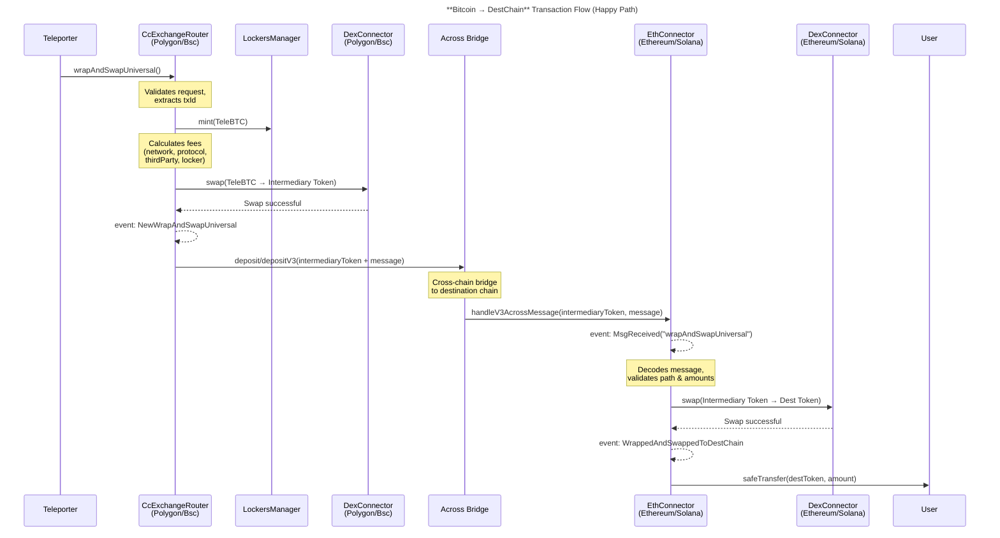
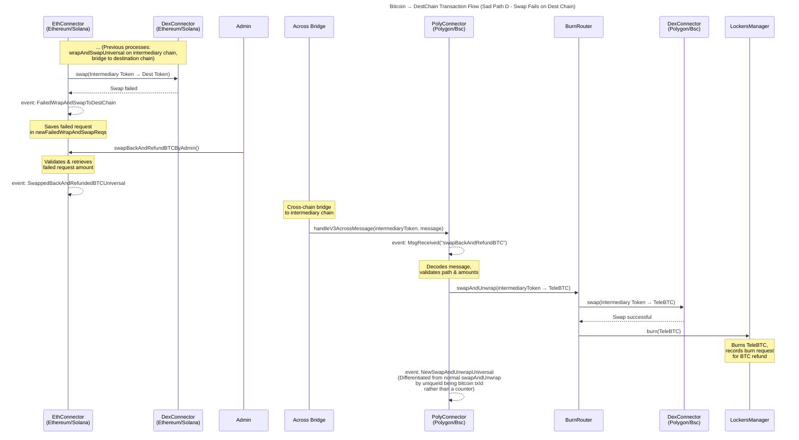
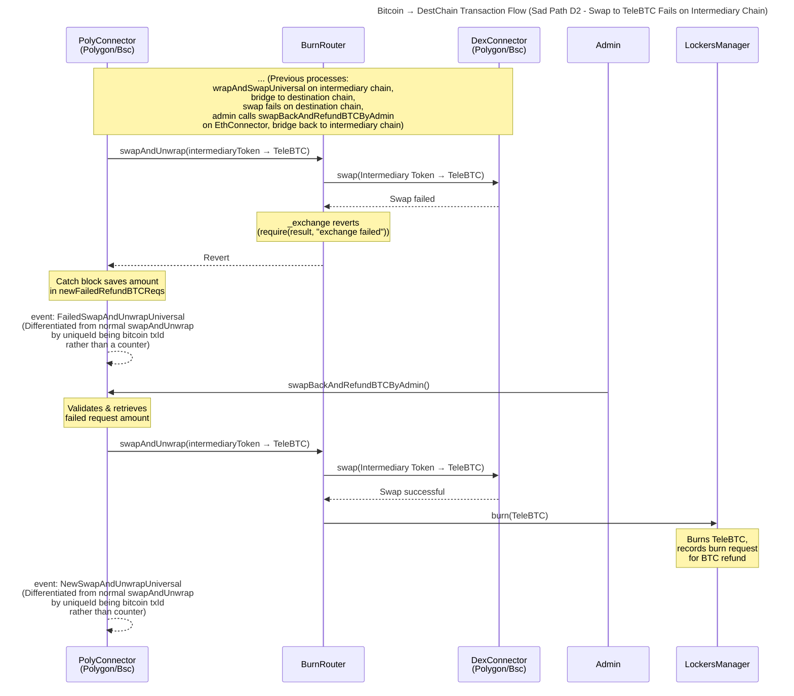
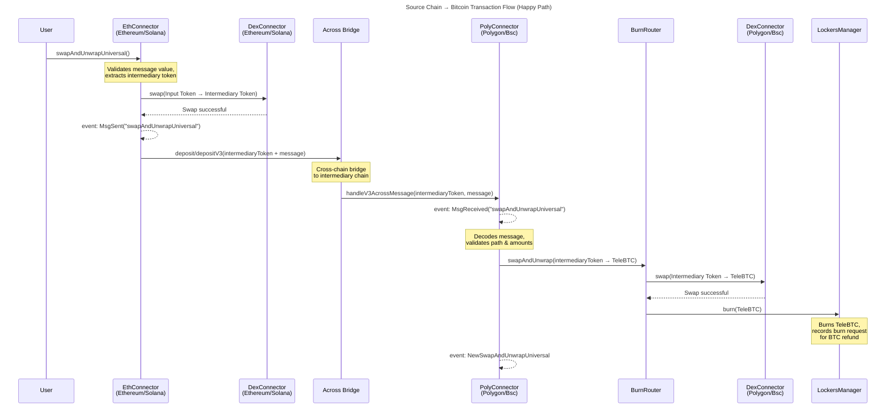
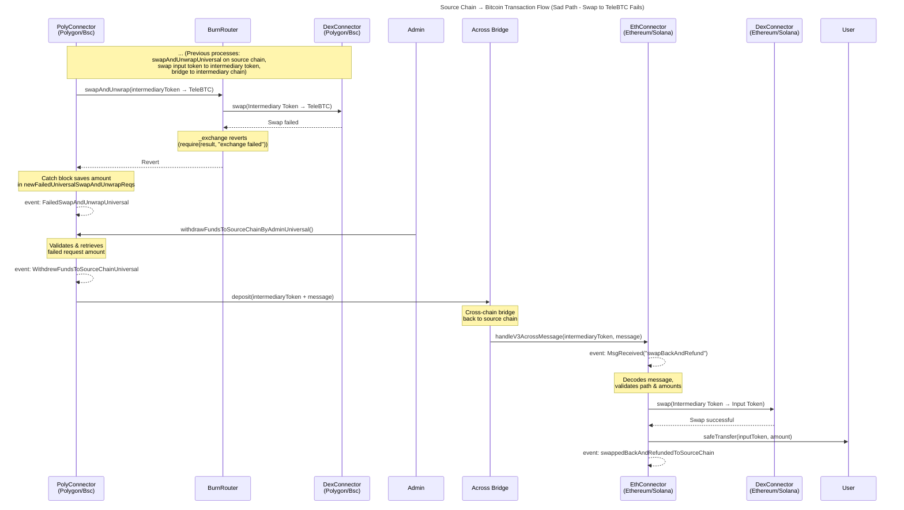

## **Bitcoin → DestChain**

Sections A to D and their sub-sections (e.g. D1, …) can be used as the different states of a “wrap and swap universal” transaction.

### **A: Happy Path**

1. Mint TeleBTC
2. Swap TeleBTC → intermediaryToken (on Polygon).
3. Bridge intermediaryToken → destChain. Here we send the intermediaryToken to the TeleSwap contract on the destChain along with a message so that contract can swap it to the destToken and send it to the correct address or refund it if necessary.
4. Swap intermediaryToken → destToken (on destChain).
5. Deliver destToken to user.

Sequence Diagram:

### **B: Sad Path (**TeleBTC → intermediaryToken swap **fails on the intermediary chain)**

Refund BTC to user through the refund admin (following our current refund process through calling refundByOwnerOrAdmin)

### **C: Sad Path (bridging from intermediary to destination chain fails)**

Intermediary token will be sent to across admin. Then we can refund BTC to user through the refund admin, following our current refund process (TODO: what is the current process?)

### **D: Sad Path (**intermediaryToken → destToken swap **fails on destChain)**

Refund BTC to user (handled by refund admin). Ideally, the refund admin should be able to perform all the steps below in a single transaction on the destination chain, initiating a request to swap the intermediaryToken back to BTC.

1. Bridge intermediary token back to intermediary chain.

    **D1: Sad Path:** If bridging fails here, intermediary tokens will be refunded to the across admin’s address on the destChain and admin can refund manually. (TODO: is manual refund in this case ok?)

2. Swap intermediaryToken → TeleBTC.

    **D2: Sad Path**: The swap fails.

3. Unwrap TeleBTC → BTC.

### **D2: Sad Path (**Swapping intermediaryToken → TeleBTC fails in a BTC refund)

If the swap fails here, intermediary tokens will remain in the intermediary chain’s connector contract. The refund admin can then swap to TeleBTC and refund BTC to user.

## **SourceChain → Bitcoin**

Sections A to D and their sub-sections (e.g. D1, …) can be used as the different states of a “swap and unwrap universal” transaction.

### **A: Happy Path**

1. Swap sourceToken → intermediaryToken (on sourceChain).
2. Bridge intermediaryToken → Polygon. We send intermediaryToken with a message to the TeleSwap contract on Polygon, which swaps it for TeleBTC and unwraps TeleBTC for the user.
3. Swap intermediaryToken → TeleBTC (on Polygon).
4. Deliver BTC to user (Unwrap TeleBTC → BTC)

### **B: Sad Path (**sourceToken → intermediaryToken swap **fails on sourceChain)**

Refund sourceToken to user (call reverts)

### **C: Sad Path (bridging from source to destination chain fails)**

When the bridge fails, intermediary token will be sent to across admin. Then we can refund the input token to user through the refund admin. (TODO: can it be manual?)

### **D: Sad Path (**intermediaryToken → TeleBTC swap **fails on the intermediary chain)**

Refund sourceToken to user (handled by refund admin). Ideally, the refund admin should be able to perform all the steps below in a single transaction on Polygon, initiating a request to swap the intermediaryToken back to sourceToken.

1. Bridge intermediaryToken back to sourceChain

    **D1: Sad Path:** If bridging fails here, intermediary tokens will be refunded to the across admin’s address on the intermediary chain and admin can manually refund input token on source chain to user (TODO: manual refund is ok?)

2. Swap intermediaryToken → sourceToken.

    **D2: Sad Path**: The swap fails.

3. Refund sourceToken to user.

### **D2: Sad Path (intermediary token swap to input token on the source chain fails)**

The failed swap back and refund request will be saved in the source chain’s connector proxy contract and the refund admin can call a function to retry swap and refund to user.
