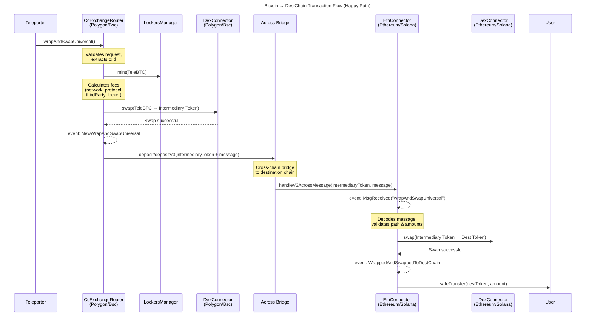
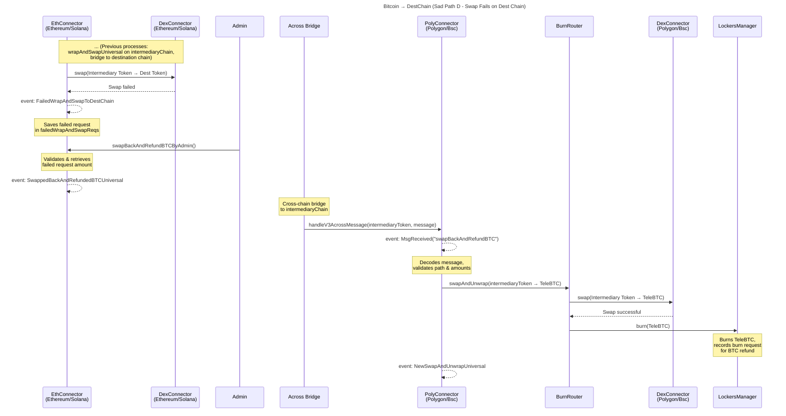
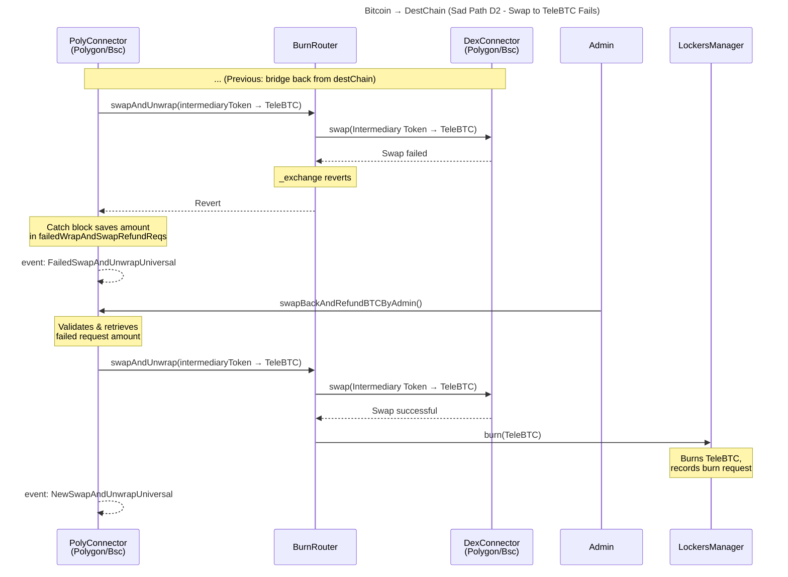
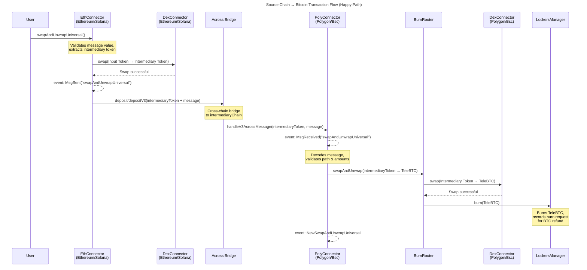
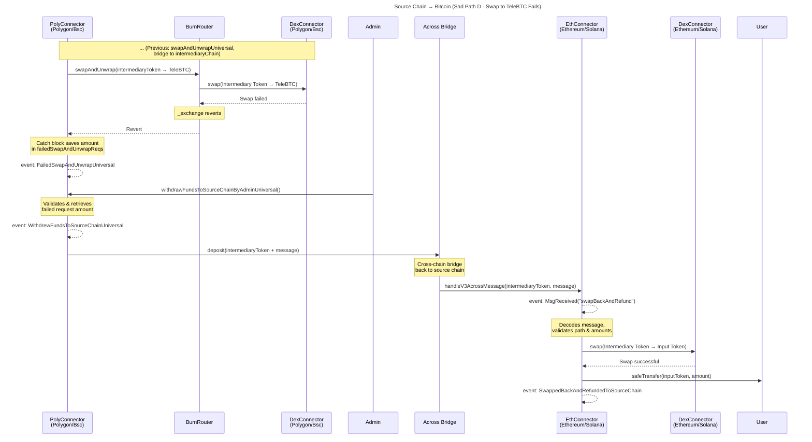

# Feature: Universal Router

## Table of Contents

-   [Problem](#problem)
-   [Solution](#solution)
-   [Scenarios](#scenarios)
    -   [Bitcoin to DestChain](#bitcoin--destchain)
    -   [SourceChain to Bitcoin](#sourcechain--bitcoin)
-   [Key Design Decisions](#key-design-decisions)
-   [Implementation](#implementation)
-   [Testing](#testing)
-   [Phases](#phases)
-   [Limitations](#limitations)
-   [Changelog](#changelog)

## Problem

Currently, TeleSwap only supports destination tokens that exist on Polygon/BSC (the intermediaryChains). Tokens not supported by the Across bridge cannot be bridged, limiting the swap options available to users.

```
CURRENT STATE
─────────────
├── Step 1: User sends BTC, wants token on Ethereum (e.g., AAVE)
├── Step 2: System can only swap to tokens that exist on Polygon AND are supported by Across
└── Result: AAVE.eth not supported because Across doesn't support bridging AAVE from Polygon to Ethereum

DESIRED STATE
─────────────
├── Step 1: User sends BTC, wants any token on any supported chain (e.g., AAVE on Ethereum)
├── Step 2: System uses intermediary token (e.g., WBTC) to bridge cross-chain
├── Step 3: Swap intermediary token to destination token on the destination chain
└── Result: User receives AAVE.eth seamlessly
```

| Aspect           | Current Limitation                                      |
| ---------------- | ------------------------------------------------------- |
| Supported Tokens | Only tokens existing on Polygon AND supported by Across |
| User Experience  | Must manually bridge and swap for unsupported tokens    |
| Business Impact  | Lower trading volume, limited market reach              |

## Solution

Introduce an **intermediary token** concept that enables swapping between Bitcoin and any token on any supported chain, regardless of whether the destination token exists on the intermediaryChain (Polygon/BSC).

### General Model

| Component             | Description                                                               | Example                   |
| --------------------- | ------------------------------------------------------------------------- | ------------------------- |
| **sourceChain**       | Where funds originate                                                     | Bitcoin, Ethereum, Solana |
| **intermediaryChain** | Chain where BTC is swapped to intermediaryToken and bridged to destChain  | Polygon, BSC              |
| **destChain**         | Where user receives tokens and intermediaryToken is swapped for destToken | Ethereum, Arbitrum, Base  |
| **destToken**         | Final token user wants                                                    | AAVE, UNI, any ERC-20     |
| **intermediaryToken** | Cross-chain bridgeable token                                              | WBTC, USDC                |

---

## Scenarios

Sections A to D and their sub-sections (e.g. D1, D2) represent different states of transactions.

---

### Bitcoin → DestChain

#### Scenario A: Happy Path

**Steps:**

1. Mint TeleBTC
2. Swap TeleBTC → intermediaryToken (on Polygon/BSC)
3. Bridge intermediaryToken → destChain (with message for swap instructions)
4. Swap intermediaryToken → destToken (on destChain)
5. Deliver destToken to user

```
STEP 1: Mint TeleBTC
├── Input:  Bitcoin transaction proof
├── Process: Validate tx, mint TeleBTC on Polygon/BSC
└── Output: TeleBTC tokens

STEP 2: Swap TeleBTC → Intermediary Token
├── Input:  TeleBTC
├── Process: DEX swap via DexConnector
└── Output: Intermediary token (e.g., WBTC)

STEP 3: Bridge to Destination Chain
├── Input:  Intermediary token + cross-chain message
├── Process: Across bridge with embedded swap instructions
└── Output: Intermediary token arrives at EthConnector

STEP 4: Swap Intermediary → DestToken
├── Input:  Intermediary token
├── Process: DEX swap via DexConnector
└── Output: destToken

STEP 5: Deliver to User
├── Input:  destToken
├── Process: safeTransfer to user address
└── Output: User receives destToken
```

**Sequence Diagram:**



---

#### Scenario B: Sad Path — TeleBTC → intermediaryToken swap fails on intermediaryChain

| Trigger                              | Resolution                       | Admin Action                                |
| ------------------------------------ | -------------------------------- | ------------------------------------------- |
| DEX swap fails (slippage, liquidity) | TeleBTC kept in CcExchangeRouter | Call `refundByOwnerOrAdmin()` to refund BTC |

**Resolution Flow:**

1. Swap fails, TeleBTC remains in contract
2. All fees (protocol, locker, network, thirdParty) are added back to `extendedCcExchangeRequests[txId].remainedInputAmount`
3. Admin calls `refundByOwnerOrAdmin()` with user's Bitcoin script
4. BTC refunded to user via locker (unwrap fees are deducted since a new burn request is initiated)

---

#### Scenario C: Sad Path — Bridging from intermediary to destination chain fails

| Trigger                                                                                                                                                                     | Resolution                              | Admin Action          |
| --------------------------------------------------------------------------------------------------------------------------------------------------------------------------- | --------------------------------------- | --------------------- |
| Across bridge fails (e.g., low fee or other reasons—contract call succeeded but Across doesn't deliver tokens on destChain and refunds to acrossAdmin on intermediaryChain) | Intermediary token sent to Across admin | Manual refund process |

**Resolution Flow:**

1. Bridge fails after `NewWrapAndSwapV2` event was emitted
2. Admin observes that no tokens are transferred to destChain
3. After a few hours, Across refunds tokens to Across admin wallet (set via `setAcrossAdmin()`)
4. Admin correlates failed bridge with original request using `txId` from `NewWrapAndSwapV2` event
5. Admin manually refunds BTC to user following standard refund process

> **Note:** Scenario C resolution relies on off-chain event monitoring. There is no on-chain mapping linking failed bridges to original requests. Admin must monitor `NewWrapAndSwapV2` events and correlate with Across bridge failures using `txId`.

---

#### Scenario D: Sad Path — intermediaryToken → destToken swap fails on destChain

| Trigger                       | Resolution                                | Admin Action                         |
| ----------------------------- | ----------------------------------------- | ------------------------------------ |
| DEX swap fails on destination | Intermediary token stored in EthConnector | Call `swapBackAndRefundBTCByAdmin()` |

**Resolution Flow:**

1. Swap fails on destination chain
2. `FailedWrapAndSwapToDestChain` event emitted
3. Amount saved in `failedWrapAndSwapReqs` mapping
4. Admin calls `swapBackAndRefundBTCByAdmin()` on EthConnector
5. Message sent back to PolyConnector via Across
6. PolyConnector swaps intermediaryToken → TeleBTC
7. TeleBTC burned, BTC released to user

**Sequence Diagram:**



---

#### Scenario D1: Sad Path — Bridge back to intermediaryChain fails (during D refund)

| Trigger                           | Resolution                               | Admin Action  |
| --------------------------------- | ---------------------------------------- | ------------- |
| Across bridge fails during refund | Tokens sent to Across admin on destChain | Manual refund |

**Resolution Flow:**
TODO (to be defined)

---

#### Scenario D2: Sad Path — intermediaryToken → TeleBTC swap fails during BTC refund

| Trigger                                | Resolution                                    | Admin Action                                          |
| -------------------------------------- | --------------------------------------------- | ----------------------------------------------------- |
| Swap to TeleBTC fails on PolyConnector | Amount saved in `failedWrapAndSwapRefundReqs` | Call `swapBackAndRefundBTCByAdmin()` on PolyConnector |

**Resolution Flow:**

1. Swap fails in PolyConnector
2. `FailedSwapAndUnwrapUniversal` event emitted
3. Amount saved in `failedWrapAndSwapRefundReqs` mapping
4. Admin calls `swapBackAndRefundBTCByAdmin()` on PolyConnector
5. Retry swap and burn

**Sequence Diagram:**



---

### SourceChain → Bitcoin

#### Scenario A: Happy Path

**Steps:**

1. Swap sourceToken → intermediaryToken (on sourceChain)
2. Bridge intermediaryToken → Polygon/BSC (with message)
3. Swap intermediaryToken → TeleBTC (on Polygon/BSC)
4. Unwrap TeleBTC → BTC (deliver to user)

```
STEP 1: Swap SourceToken → Intermediary Token
├── Input:  User's source token (e.g., AAVE)
├── Process: DEX swap via DexConnector
└── Output: Intermediary token (e.g., WBTC)

STEP 2: Bridge to Intermediary Chain
├── Input:  Intermediary token + cross-chain message
├── Process: Across bridge to Polygon/BSC
└── Output: Intermediary token arrives at PolyConnector

STEP 3: Swap Intermediary → TeleBTC
├── Input:  Intermediary token
├── Process: DEX swap via DexConnector
└── Output: TeleBTC

STEP 4: Unwrap TeleBTC → BTC
├── Input:  TeleBTC
├── Process: Burn TeleBTC, locker releases BTC
└── Output: User receives BTC
```

**Sequence Diagram:**



---

#### Scenario B: Sad Path — sourceToken → intermediaryToken swap fails on sourceChain

| Trigger                        | Resolution          | Admin Action     |
| ------------------------------ | ------------------- | ---------------- |
| DEX swap fails on source chain | Transaction reverts | None (automatic) |

**Resolution:** Transaction reverts, user keeps their sourceToken.

---

#### Scenario C: Sad Path — Bridging from source to intermediaryChain fails

| Trigger             | Resolution                              | Admin Action                 |
| ------------------- | --------------------------------------- | ---------------------------- |
| Across bridge fails | Intermediary token sent to Across admin | Manual refund of sourceToken |

**Resolution Flow:**

1. Bridge fails after `MsgSent("swapAndUnwrapUniversal")` event was emitted
2. Intermediary tokens land in Across admin wallet
3. Admin correlates failed bridge with original request using off-chain event monitoring (`uniqueCounter` in events provides correlation)
4. Admin manually swaps intermediary token back to sourceToken and refunds to user

> **Note:** Scenario C resolution relies on off-chain event monitoring. Admin must monitor `MsgSent` events and correlate with Across bridge failures. The refund requires admin to swap intermediary token → sourceToken before sending to user.

---

#### Scenario D: Sad Path — intermediaryToken → TeleBTC swap fails on intermediaryChain

| Trigger               | Resolution                                | Admin Action                                        |
| --------------------- | ----------------------------------------- | --------------------------------------------------- |
| Swap to TeleBTC fails | Amount saved in `failedSwapAndUnwrapReqs` | Call `withdrawFundsToSourceChainByAdminUniversal()` |

**Resolution Flow:**

1. Swap fails on PolyConnector
2. `FailedSwapAndUnwrapUniversal` event emitted
3. Amount and original path saved in `failedSwapAndUnwrapReqs` mapping (includes `pathFromInputToIntermediaryOnSourceChain`)
4. Admin calls `withdrawFundsToSourceChainByAdminUniversal()` with reverse path
5. Contract validates reverse path: intermediary token must match original path end, input token must match original path start
6. Message with purpose `"swapBackAndRefund"` sent back to EthConnector via Across
7. EthConnector swaps intermediaryToken → sourceToken
8. sourceToken refunded to user

**Sequence Diagram:**



---

#### Scenario D1: Sad Path — Bridge back to source chain fails (during D refund)

| Trigger                           | Resolution                                       | Admin Action                 |
| --------------------------------- | ------------------------------------------------ | ---------------------------- |
| Across bridge fails during refund | Tokens sent to Across admin on intermediaryChain | Manual refund of sourceToken |

---

#### Scenario D2: Sad Path — intermediaryToken → sourceToken swap fails on source chain

| Trigger                        | Resolution                                      | Admin Action                                |
| ------------------------------ | ----------------------------------------------- | ------------------------------------------- |
| Swap back to sourceToken fails | Amount saved in `failedSwapAndUnwrapRefundReqs` | Call `refundFailedSwapAndUnwrapUniversal()` |

**Resolution Flow:**

1. Swap fails on EthConnector
2. `FailedSwapBackAndRefundToSourceChain` event emitted
3. Amount saved in mapping
4. Admin calls `refundFailedSwapAndUnwrapUniversal()`
5. Retry swap and transfer to user

---

### Scenario Summary Table

| Direction | Scenario | Failure Point               | Storage Mapping                                        | Admin Function                                                                    |
| --------- | -------- | --------------------------- | ------------------------------------------------------ | --------------------------------------------------------------------------------- |
| BTC→Dest  | B        | TeleBTC→Intermediary swap   | `extendedCcExchangeRequests[txId].remainedInputAmount` | `refundByOwnerOrAdmin()` (CcExchangeRouter, intermediaryChain)                    |
| BTC→Dest  | C        | Bridge to dest              | Across admin (off-chain)                               | Manual                                                                            |
| BTC→Dest  | D        | Intermediary→DestToken swap | `failedWrapAndSwapReqs`                                | `swapBackAndRefundBTCByAdmin()` (EthConnector, destChain)                         |
| BTC→Dest  | D1       | Bridge back                 | Across admin (off-chain)                               | Manual                                                                            |
| BTC→Dest  | D2       | Intermediary→TeleBTC swap   | `failedWrapAndSwapRefundReqs`                          | `swapBackAndRefundBTCByAdmin()` (PolyConnector, intermediaryChain)                |
| Src→BTC   | B        | Source→Intermediary swap    | N/A (reverts)                                          | None                                                                              |
| Src→BTC   | C        | Bridge to intermediary      | Across admin (off-chain)                               | Manual                                                                            |
| Src→BTC   | D        | Intermediary→TeleBTC swap   | `failedSwapAndUnwrapReqs`                              | `withdrawFundsToSourceChainByAdminUniversal()` (PolyConnector, intermediaryChain) |
| Src→BTC   | D1       | Bridge back                 | Across admin (off-chain)                               | Manual                                                                            |
| Src→BTC   | D2       | Intermediary→Source swap    | `failedSwapAndUnwrapRefundReqs`                        | `refundFailedSwapAndUnwrapUniversal()` (EthConnector, sourceChain)                |

> **Note on Storage:** Each failure type uses a separate mapping to prevent collisions. For BTC→Dest flows, `bitcoinTxId` (bytes32) is used as the key. For Src→BTC flows, `uniqueCounter` (uint256) is used. These are different value spaces and stored in different mappings.

---

## Key Design Decisions

| Decision                   | Choice                                                                                   | Rationale                                                           | Prevents                                  |
| -------------------------- | ---------------------------------------------------------------------------------------- | ------------------------------------------------------------------- | ----------------------------------------- |
| Intermediary Token Mapping | `bytes8 => uint256 => bytes32` (output token ID → chain ID → intermediary token address) | To bridge intermediary token instead of the output token via Across | Wrong path provided by Teleporter         |
| Intermediary Token         | WBTC preferred                                                                           | Lower price fluctuation risk vs stablecoins                         | Swap failures due to slippage             |
| Refund Currency            | Always sourceToken on sourceChain                                                        | Consistent user experience                                          | User receiving unexpected tokens          |
| New Function               | `swapAndUnwrapV3` on EthConnector                                                        | Backward compatibility                                              | Breaking existing integrations            |
| Removed Function           | `wrapAndSwapV2` removed from CcExchangeRouter                                            | Not enough space in contract                                        | N/A                                       |
| Message Encoding           | ABI-encoded for EVM, raw bytes for Solana                                                | Chain-specific optimization                                         | Cross-chain compatibility issues          |
| OP_RETURN Structure        | Add `minIntermediaryTokenAmount`                                                         | On-chain slippage protection                                        | MEV/sandwich attacks on intermediary swap |
| Failed Request Storage     | Separate mappings per failure type                                                       | Clear state management                                              | State corruption, incorrect refunds       |
| Solana Address Format      | `bytes32` for all Solana addresses                                                       | Solana uses 32-byte addresses vs EVM 20-byte                        | Address truncation errors                 |
| Fee Handling on Failure    | Return all fees to user on swap failure                                                  | Minimize user loss on failures                                      | User paying fees for failed transactions  |

### Security Properties

| #   | Verification                                                   | What It Prevents                      | Status |
| --- | -------------------------------------------------------------- | ------------------------------------- | ------ |
| 1   | Path validation (first token = intermediary, last = destToken) | Invalid swap paths, token theft       | Done   |
| 2   | Amount validation (minOutput checks at each step)              | Excessive slippage, front-running     | Done   |
| 3   | Admin-only refund functions                                    | Unauthorized fund withdrawal          | Done   |
| 4   | Chain ID validation                                            | Cross-chain replay attacks            | Done   |
| 5   | Connector proxy mapping verification                           | Message delivery to wrong contracts   | Done   |
| 6   | Reverse path validation against original path endpoints        | Admin providing malicious refund path | Done   |
| 7   | Separate storage mappings per failure type                     | uniqueCounter/bitcoinTxId collision   | Done   |

---

## Implementation

### Files

```
teleswap-contracts/
├── contracts/
│   ├── chain_connectors/
│   │   ├── EthConnectorLogic.sol      # Destination chain connector (Ethereum, etc.)
│   │   ├── EthConnectorStorage.sol    # Storage for failed requests mappings
│   │   ├── PolyConnectorLogic.sol     # Intermediary chain connector (Polygon/BSC)
│   │   ├── PolyConnectorStorage.sol   # Storage for universal swap data
│   │   └── interfaces/
│   │       ├── IEthConnector.sol
│   │       └── IPolyConnector.sol
│   ├── routers/
│   │   ├── CcExchangeRouterLogic.sol  # Main entry point for BTC → Any swaps
│   │   ├── CcExchangeRouterStorageV2.sol
│   │   ├── CcExchangeRouterLib.sol
│   │   ├── CcExchangeRouterLibExtension.sol
│   │   └── BurnRouterLogic.sol        # Handles TeleBTC burning
│   └── dex_connectors/
│       ├── UniswapV2Connector.sol
│       └── UniswapV3Connector.sol
├── docs/
│   ├── universal-router.md            # This document
│   └── universal-router-diagrams.md   # Additional sequence diagrams
└── test/
    ├── cc_exchange_router.test.ts     # CcExchangeRouter universal tests
    ├── cc_exchange_with_filler_router.test.ts  # Filler universal tests
    ├── cc_exchange_to_solana_router.test.ts    # Solana universal tests
    ├── evm_connector.test.ts          # EthConnector universal tests
    └── poly_connector.test.ts         # PolyConnector universal tests
```

### Types

```solidity
// IEthConnector.sol (inherited by EthConnectorStorage.sol)
struct BridgeConnectorData {
    uint256 targetChainId;
    address targetChainConnectorProxy;
}

// IEthConnector.sol & IPolyConnector.sol (defined in both interfaces)
struct SwapAndUnwrapUniversalPaths {
    address[] _pathFromInputToIntermediaryOnSourceChain;
    address[] _pathFromIntermediaryToOutputOnIntermediaryChain;
}

// EthConnectorStorage.sol - Mappings for failed requests
mapping(address => mapping(uint256 => mapping(bytes32 => mapping(address => uint256))))
    public failedWrapAndSwapReqs;
// ^ [targetAddress][intermediaryChainId][bitcoinTxId][intermediaryToken] => amount
// Stores: BTC→Dest Scenario D failures (intermediaryToken → destToken swap fails on destChain)

mapping(address => mapping(address => mapping(uint256 => mapping(address => uint256))))
    public failedSwapAndUnwrapRefundReqs;
// ^ [refundAddress][inputToken][uniqueCounter][intermediaryToken] => amount
// Stores: Src→BTC Scenario D2 failures (intermediaryToken → sourceToken swap fails on sourceChain)

// PolyConnectorStorage.sol
struct SwapAndUnwrapUniversalData {
    bytes32[] pathFromInputToIntermediaryOnSourceChain;
    uint256 intermediaryTokenAmount;
}

// PolyConnectorStorage.sol - Mappings for failed requests
mapping(address => mapping(uint256 => mapping(address => uint256)))
    public failedSwapAndUnwrapReqs;
// ^ [refundAddress][uniqueCounter][intermediaryToken] => amount
// Stores: Src→BTC Scenario D failures (intermediaryToken → TeleBTC swap fails on intermediaryChain)

mapping(address => mapping(bytes32 => mapping(address => uint256)))
    public failedWrapAndSwapRefundReqs;
// ^ [targetAddress][bitcoinTxId][intermediaryToken] => amount
// Stores: BTC→Dest Scenario D2 failures (intermediaryToken → TeleBTC swap fails during BTC refund)

// CcExchangeRouterStorageV2.sol
mapping(uint256 => bytes32) public destConnectorProxyMapping;
// ^ destination chain id => connector proxy address

mapping(bytes8 => mapping(uint256 => bytes32)) public intermediaryTokenMapping;
// ^ output token ID => chain ID => intermediary token address on this chain ID
//
// Why this mapping is needed:
// Across only bridges specific canonical tokens (USDC, USDT, WBTC, etc.), not arbitrary ERC-20s.
// When bridging, we need to specify the intermediary token address on the DESTINATION chain
// as Across's output token. The old mapping (bytes8 => address) only stored the intermediary
// token on the current chain, which was insufficient for constructing cross-chain messages.
// This new mapping allows lookup of the intermediary token for any supported chain.
// The path validation (first element must match this mapping) prevents backend mistakes.
```

### Key Functions

#### Bitcoin → DestChain

```solidity
// CcExchangeRouterLogic.sol
function wrapAndSwapUniversal(
    TxAndProof memory _txAndProof,
    bytes calldata _lockerLockingScript,
    address[] memory _pathFromTeleBtcToIntermediary,
    bytes32[] memory _pathFromIntermediaryToDestTokenOnDestChain,
    uint256[] memory _amountsFromIntermediaryToDestTokenOnDestChain
) external payable returns (bool);

function fillTxUniversal(
    bytes32 _txId,
    bytes32 _recipient,
    address _intermediaryToken,
    bytes32 _outputToken,
    uint _fillAmount,
    uint _userRequestedAmount,
    uint _destRealChainId,
    uint _bridgePercentageFee,
    bytes memory _lockerLockingScript,
    bytes32[] memory _pathFromIntermediaryToDestTokenOnDestChain,
    uint256[] memory _amountsFromIntermediaryToDestTokenOnDestChain
) external payable;
```

#### SourceChain → Bitcoin

```solidity
// EthConnectorLogic.sol
function swapAndUnwrapUniversal(
    SwapAndUnwrapUniversalArguments calldata _arguments,
    address _exchangeConnector,
    bool _isInputFixed,
    UserAndLockerScript calldata _userAndLockerScript,
    uint256 _thirdParty,
    address _refundAddress
) external payable;
```

#### Admin Refund Functions

```solidity
// EthConnectorLogic.sol
function swapBackAndRefundBTCByAdmin(SwapBackAndRefundBTCArguments calldata _args) external;
function refundFailedSwapAndUnwrapUniversal(...) external;

// PolyConnectorLogic.sol
function withdrawFundsToSourceChainByAdminUniversal(...) external;
function swapBackAndRefundBTCByAdmin(...) external;
```

### Setter Functions (Post-Deployment Configuration)

#### EthConnectorLogic.sol

```solidity
EthConnector.setBridgeConnectorMapping(exchangeConnectorAddress, targetChainId, targetChainConnectorProxy);
EthConnector.setExchangeConnector(exchangeConnectorAddress);
```

#### PolyConnectorLogic.sol

```solidity
PolyConnector.setBridgeConnectorMapping(chainId, bridgeConnectorAddress);
PolyConnector.setBridgeTokenMappingUniversal(sourceToken, destinationChainId, destinationToken);
PolyConnector.setCurrChainId(chainId);
```

#### CcExchangeRouterLogic.sol

```solidity
CcExchangeRouter.setDestConnectorProxyMapping(destRealChainId, destConnectorProxy);
CcExchangeRouter.setIntermediaryTokenMapping(outputTokenID, chainId, intermediaryToken);
```

### Events

```solidity
// CcExchangeRouterLogic.sol
event NewWrapAndSwapUniversal(...);
event FailedWrapAndSwapUniversal(...);
event RequestFilledUniversal(...);
event FillerRefunded(...);
event RefundProcessed(...);

// EthConnectorLogic.sol
event MsgSent(uint256 uniqueCounter, bytes message, address token, uint256 amount, int64 bridgePercentageFee);
event MsgReceived(string purpose, uint256 uniqueCounter, uint256 chainId, bytes message);
event WrappedAndSwappedToDestChain(...);
event FailedWrapAndSwapToDestChain(...);
event SwappedBackAndRefundedBTCUniversal(...);
event RefundedFailedSwapAndUnwrapUniversal(...);
event SwappedBackAndRefundedToSourceChain(...);
event FailedSwapBackAndRefundToSourceChain(...);

// PolyConnectorLogic.sol
event NewSwapAndUnwrapUniversal(...);
event FailedSwapAndUnwrapUniversal(...);
event WithdrewFundsToSourceChainUniversal(...);
```

### Deployments

| Network  | Contract              | Address |
| -------- | --------------------- | ------- |
| Polygon  | CcExchangeRouterProxy | `TBD`   |
| Polygon  | PolyConnectorProxy    | `TBD`   |
| BSC      | CcExchangeRouterProxy | `TBD`   |
| BSC      | PolyConnectorProxy    | `TBD`   |
| Ethereum | EthConnectorProxy     | `TBD`   |
| Arbitrum | EthConnectorProxy     | `TBD`   |
| Base     | EthConnectorProxy     | `TBD`   |

---

## Testing

### Prerequisites

```bash
cp .env.example .env
npm install
```

### Test Files

| File                                          | Description                              | Run Command                                                    |
| --------------------------------------------- | ---------------------------------------- | -------------------------------------------------------------- |
| `test/cc_exchange_router.test.ts`             | CcExchangeRouter universal wrap and swap | `npx hardhat test test/cc_exchange_router.test.ts`             |
| `test/cc_exchange_with_filler_router.test.ts` | Filler universal transactions            | `npx hardhat test test/cc_exchange_with_filler_router.test.ts` |
| `test/cc_exchange_to_solana_router.test.ts`   | Solana universal swaps                   | `npx hardhat test test/cc_exchange_to_solana_router.test.ts`   |
| `test/evm_connector.test.ts`                  | EthConnector universal functions         | `npx hardhat test test/evm_connector.test.ts`                  |
| `test/poly_connector.test.ts`                 | PolyConnector universal functions        | `npx hardhat test test/poly_connector.test.ts`                 |

### Test Cases by File

#### cc_exchange_router.test.ts

| Test                                                                                                                    | Description                                | Line |
| ----------------------------------------------------------------------------------------------------------------------- | ------------------------------------------ | ---- |
| `Swap tokens to the destination token after sending it to the destination chain using across (universal wrap and swap)` | Happy path BTC→DestChain with swap on dest | 3026 |
| `Revert since destination chain connector proxy mapping is not set`                                                     | Validation test                            | 3240 |
| `Revert since chain is not supported in a universal wrap and swap`                                                      | Chain validation                           | 3325 |
| `Keep TeleBTC in the contract since swap failed in a universal wrap and swap`                                           | Sad path - swap failure                    | 3371 |
| `Refund TeleBTC for a failed cross chain universal wrap and swap`                                                       | Admin refund flow                          | 3515 |
| `Cannot refund twice for a failed cross chain universal wrap and swap`                                                  | Double refund prevention                   | 3638 |

#### cc_exchange_with_filler_router.test.ts

| Test                                                                  | Description           | Line |
| --------------------------------------------------------------------- | --------------------- | ---- |
| `Filler can fill a universal transaction (swap on destination chain)` | Filler universal flow | 885  |

#### cc_exchange_to_solana_router.test.ts

| Test                                             | Description              | Line |
| ------------------------------------------------ | ------------------------ | ---- |
| `Send token (USDC) to Solana chain using across` | BTC→Solana universal     | 908  |
| `Receive SOL on Solana using across`             | Solana destination token | 1046 |

#### evm_connector.test.ts

| Test                                                                             | Description                       | Line |
| -------------------------------------------------------------------------------- | --------------------------------- | ---- |
| `should swap and bridge to the intermediaryChain`                                | swapAndUnwrapUniversal happy path | 669  |
| `should fail and revert if swap on the source chain fails`                       | Source swap failure (Scenario B)  | 793  |
| `should handle swapBackAndRefund message`                                        | Refund message handling           | 857  |
| `should handle swapBackAndRefund message failure and allow admin to refund`      | Admin retry refund                | 935  |
| `should handle wrapAndSwapUniversal message and send user the destination token` | Receive and swap on dest          | 1248 |
| `fails because swap after handling wrapAndSwapUniversal message fails`           | Dest swap failure (Scenario D)    | 1341 |
| `should bridge back and refund user (with BTC)`                                  | swapBackAndRefundBTCByAdmin       | 1428 |

#### poly_connector.test.ts

| Test                                                                       | Description                                | Line |
| -------------------------------------------------------------------------- | ------------------------------------------ | ---- |
| `should swap and unwrap successfully`                                      | swapAndUnwrapUniversal happy path          | 1255 |
| `admin should withdraw funds to source chain if the swap and unwrap fails` | withdrawFundsToSourceChainByAdminUniversal | 1344 |
| `handles swapBackAndRefundBTC message and refunds user with BTC`           | BTC refund flow                            | 1500 |
| `handles swapBackAndRefundBTC failure then admin retry succeeds`           | Admin retry (Scenario D2)                  | 1599 |

### Run All Universal Tests

```bash
npx hardhat test test/cc_exchange_router.test.ts test/cc_exchange_with_filler_router.test.ts test/cc_exchange_to_solana_router.test.ts test/evm_connector.test.ts test/poly_connector.test.ts
```

### Security Tests

| Scenario               | Action                                           | Expected Result                       |
| ---------------------- | ------------------------------------------------ | ------------------------------------- |
| Invalid path injection | Submit wrapAndSwapUniversal with mismatched path | Reverts: "invalid path"               |
| Insufficient amount    | Submit with amount below minimum                 | Reverts: "invalid dest output amount" |
| Unauthorized refund    | Non-admin calls refund function                  | Reverts: "not authorized"             |
| Replay attack          | Resubmit processed transaction                   | Reverts: "already processed"          |
| Wrong chain ID         | Message with incorrect destination chain         | Reverts: "invalid destination chain"  |
| Double refund          | Call refund twice for same request               | Reverts: "already withdrawn"          |

---

## Phases

### Phase 1: Core Infrastructure [done]

-   [x] EthConnectorLogic implementation
-   [x] PolyConnectorLogic implementation
-   [x] CcExchangeRouterLogic wrapAndSwapUniversal
-   [x] Storage contracts and mappings
-   [x] Basic message encoding/decoding

### Phase 2: Happy Path [done]

-   [x] Bitcoin → DestChain flow
-   [x] SourceChain → Bitcoin flow
-   [x] Cross-chain message handling via Across
-   [x] DEX integration for swaps

### Phase 3: Error Handling [done]

-   [x] Failed swap storage (all failure mappings)
-   [x] Admin refund functions
-   [x] Retry mechanisms
-   [x] Event emission for monitoring

### Phase 4: Fast Fill Support [done]

-   [x] fillTxUniversal implementation
-   [x] Filler address tracking
-   [x] TeleBTC refund to fillers

### Phase 5: Production Hardening [in-progress]

-   [x] Decimal conversion for cross-chain tokens (USDT/USDC)
-   [x] Gas limit checks
-   [ ] Mainnet deployment
-   [x] Documentation

### Phase 6: Solana Support [in-progress]

-   [x] Raw byte message encoding for Solana
-   [x] Solana-specific message decoding
-   [ ] Full Solana connector integration

---

## Limitations

-   **Manual Admin Intervention** — Some failure scenarios (Sad Path C, D1) require manual admin intervention via off-chain event monitoring
-   **Solana Support Partial** — Solana message encoding exists but full integration pending
-   **Intermediary Token Risk** — Price fluctuations during multi-step process could affect final amounts
-   **Gas Costs** — Multiple swaps and cross-chain messages increase total gas costs
-   **Decimal Handling** — Special handling required for tokens with different decimals (USDT: 18 on BSC, 6 elsewhere)

---

## Changelog

| Date       | Version | Changes                                   |
| ---------- | ------- | ----------------------------------------- |
| 2024-XX-XX | 0.1.0   | Initial design and implementation         |
| 2024-XX-XX | 0.2.0   | Added fast fill support (fillTxUniversal) |
| 2024-XX-XX | 0.3.0   | Added decimal conversion for USDT/USDC    |
| 2024-XX-XX | 0.4.0   | Added Solana message encoding support     |
